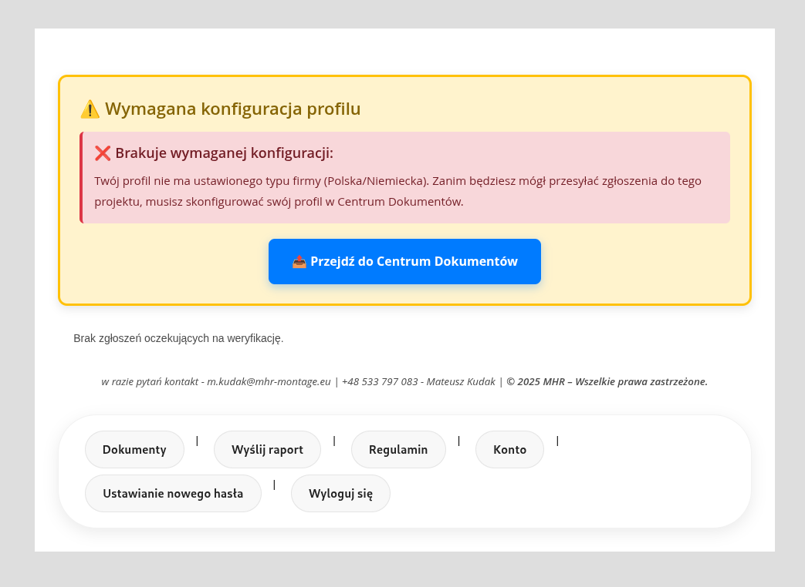

# Business Impact

## Why the numbers matter

The value of this project is not that it digitized a few messy tasks.

The value is that it changed the underlying workflow. Once reporting, compliance, attendance, and review started feeding the same system, the business stopped losing time in the gaps between tools.

## Outcome snapshot

| Metric | Before | After | Why it matters |
|--------|--------|-------|----------------|
| Report approval cycle | 48 hours | 12 hours | less delay between work done and work confirmed |
| Expired document incidents | 6 per month | 0 per month | compliance moved from reactive to controlled |
| Payroll correction rate | 18% | under 5% | attendance data became far more trustworthy |
| Admin coordination overhead | high manual effort | lower by about 20 hours per week | less time spent chasing and reconciling data |

## Reporting and approvals

Before the platform, work updates could disappear into message threads or depend on someone remembering to follow up.

After the platform, submissions entered a visible review flow. That gave supervisors a clear queue, made status visible, and reduced the lag between field execution and managerial approval.

## Compliance control

This was one of the biggest operational upgrades.

Instead of discovering missing or expired documents after a problem had already happened, the system made document status visible and tied it to workflow rules. In key cases, workers could not continue until mandatory compliance requirements were satisfied.

That is why the document metrics are so strong: the system did not just notify people, it changed the cost of ignoring the issue.

## Why the improvements compound

These gains are connected.

- Better reporting improves visibility.
- Better compliance reduces risk.
- Better attendance data reduces payroll friction.
- Better operational visibility reduces wasted coordination.

Each part makes the others more valuable.

