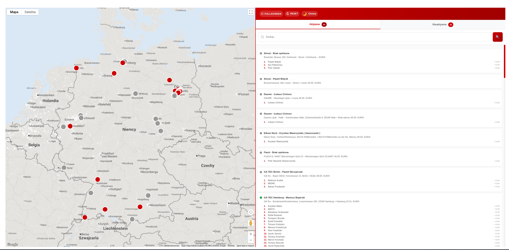
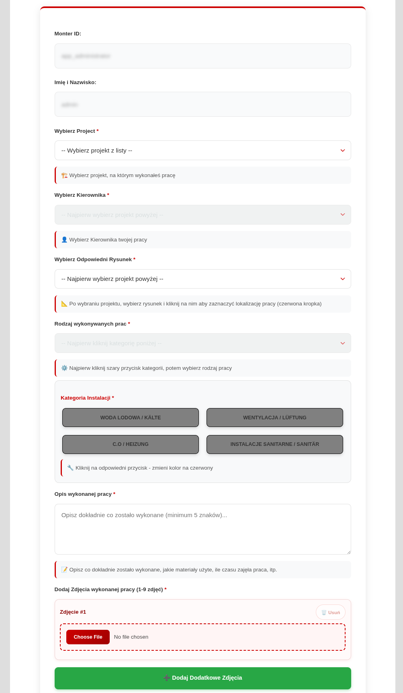
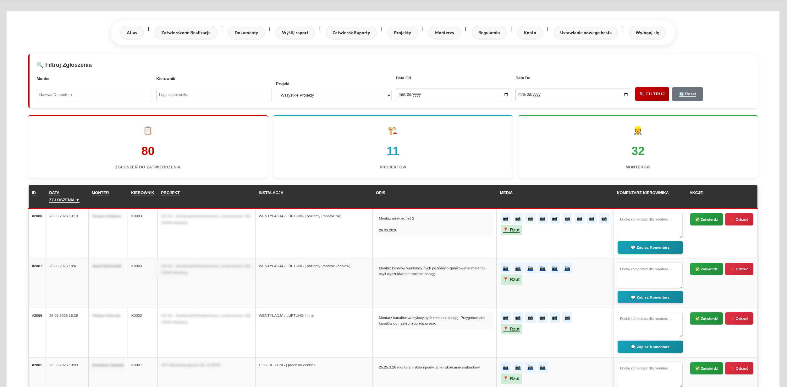
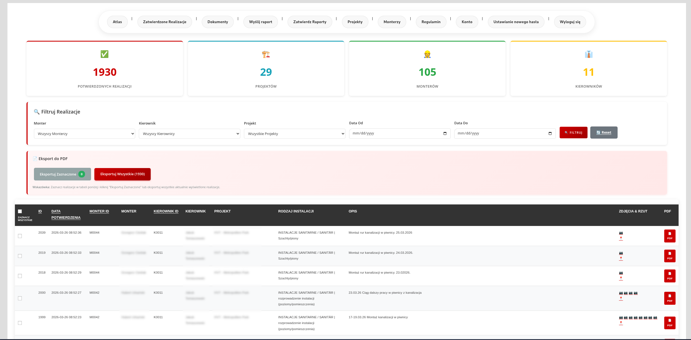
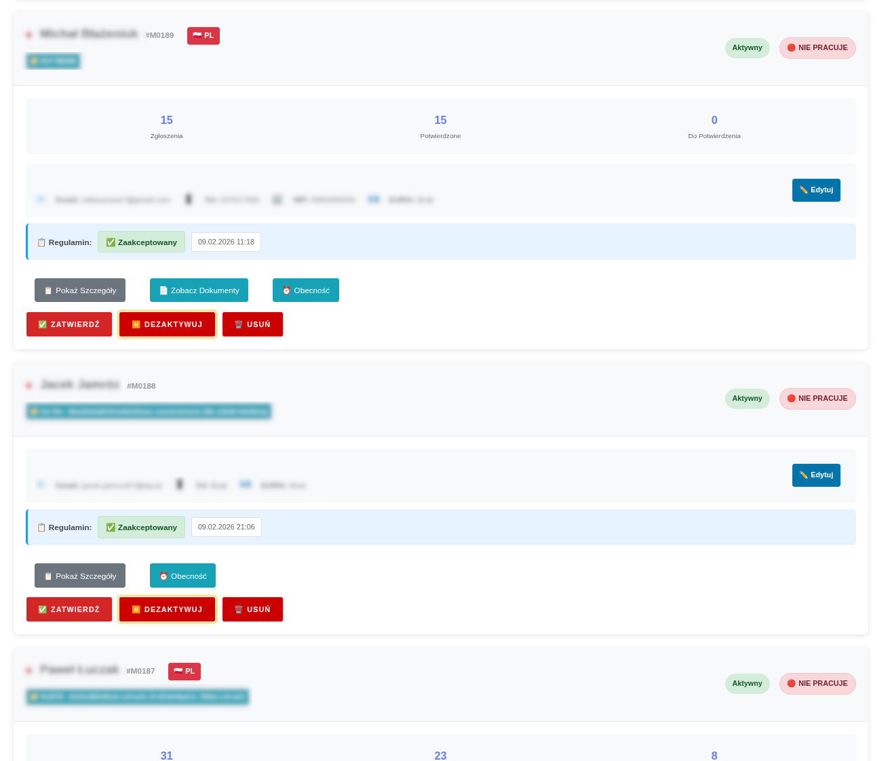

# Northfield Ops Platform

the company and product name are intentionally anonymized for this public case study. the platform is presented here under the working name northfield ops.

i designed and built this platform as the sole developer, working directly with operations management to map workflows, define the data model, and deliver a system used daily by a 200+ person field workforce across poland and germany.

before the platform, the business relied on chat messages, spreadsheets, phone calls, inbox attachments, and manual follow-up. approvals were slow, compliance issues were discovered too late, and leadership had no live picture of what was happening in the field.

the platform brought those workflows into one governed system - field reporting and approvals, document compliance and expiry tracking, attendance and time records, and map-based operational visibility.

## Outcome snapshot

| metric | before | after |
|--------|--------|-------|
| report approval cycle | 48 hours | 12 hours |
| expired document incidents | 6 per month | 0 per month |
| payroll correction rate | 18% | under 5% |
| admin coordination overhead | high manual effort | lower by about 20 hours per week |

## Screenshots

map-based project and workforce visibility replacing spreadsheet job lists.

structured field report submission tied to project, supervisor, and evidence upload.

submissions queued for review with full status tracking.

approved submissions with pdf export for payroll and compliance records.

worker list with compliance status, assignments, and document state visible in one view.

## Reading Paths

### for a recruiter, ceo, or portfolio reviewer
1. [executive case study](00-executive-case-study.md)
2. [platform overview](01-platform-overview.md)
3. [business impact](06-business-impact.md)

### for a technical reviewer
1. [system architecture](02-system-architecture.md)
2. [user roles and workflows](03-user-roles-and-workflows.md)
3. [data model and integrations](04-data-model-and-integrations.md)
4. [security and governance](05-security-and-governance.md)

## Licence

mit

## Contact

Lukasz Kedzielawski
lukasz@kedzielawski.com
[linkedin.com/in/lukasz-kedzielawski](https://linkedin.com/in/lukasz-kedzielawski)
[kedzielawski.com](https://kedzielawski.com)
